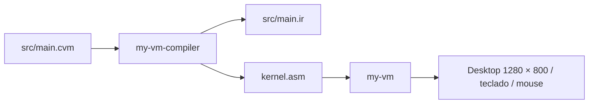

# my-vm-os · Zorin VM OS

Sistema experimental em **CVM**, feito para a arquitetura simulada da [my-vm](https://github.com/emanuelVINI01/my-vm). O código implementa um desktop com janelas, barra de tarefas, terminal, editor, calculadora e explorador de arquivos. É um ambiente convidado dentro da VM executada no sistema hospedeiro.

## Como funciona



O ponto de entrada importa drivers, VFS, gerenciador de janelas e aplicativos. Inicializa títulos e estado, registra handlers de interrupção e mantém o loop de eventos. As rotinas CVM usam `asm` para pedir desenho, entrada e atualização de tela ao runtime. `YIELD` permite à VM processar eventos.

| Componente | Papel |
| --- | --- |
| `src/drivers/vga.cvm` | Primitivas gráficas, texto, cores e mouse |
| `src/drivers/keyboard.cvm` | Teclas e estado de entrada |
| `src/kernel/wm.cvm` | Janelas, foco e interação |
| `src/kernel/desktop.cvm` | Desktop e ícones |
| `src/kernel/taskbar.cvm` | Barra de tarefas |
| `src/kernel/vfs.cvm` | Arquivos armazenados na RAM |
| `src/apps/terminal.cvm` | Terminal e comandos internos |
| `src/apps/editor.cvm` | Edição de texto |
| `src/apps/calculator.cvm` | Calculadora |
| `src/apps/files.cvm` | Navegação dos arquivos do VFS |
| `src/kernel/shell.cvm` | Shell anterior, fora dos imports do ponto de entrada atual |

Apesar do nome `vga.cvm`, o driver usa o framebuffer gráfico da VM, com resolução 1280 × 800. Timer, teclado e Alt+Tab usam interrupções simuladas 32, 33 e 34.

## Compilar e executar

Requer Rust/Cargo para construir a toolchain, sessão gráfica compatível com `minifb` e memória para a VM (aproximadamente 1 GiB de RAM simulada).

Organize os repositórios como diretórios irmãos:

```text
workspace/
├── my-vm/
├── my-vm-compiler/
└── my-vm-os/
```

A partir de `workspace/`:

```bash
cargo run --release --manifest-path my-vm-compiler/Cargo.toml -- my-vm-os/src/main.cvm my-vm-os/kernel.asm
cargo run --release --manifest-path my-vm/Cargo.toml --bin my-vm -- my-vm-os/kernel.asm
```

A primeira etapa escreve `src/main.ir` e `kernel.asm`. O comando antigo apontava para `test.cvm`, que não existe; o ponto de entrada é `src/main.cvm`. `kernel.asm` já versionado pode estar desatualizado e deve ser regenerado para a versão da toolchain utilizada.

## Estado e limites

A compilação de `src/main.cvm` com o compilador atual passou na revisão de 05/10/2026. A sessão gráfica e as interações dos aplicativos não foram executadas nesta revisão; compilação não garante funcionamento integral.

O VFS guarda até 32 entradas em memória e perde os dados ao encerrar a VM. Não há persistência em disco demonstrada, isolamento de processos ou escalonador preemptivo comprovado. A base usa endereços fixos e rotinas experimentais de alocação; não é um sistema para armazenar dados importantes.

Não há arquivo de licença neste repositório; não se deve inferir a licença a partir dos outros componentes.

## Projetos relacionados

- [my-vm](https://github.com/emanuelVINI01/my-vm): instruções, memória e dispositivos simulados.
- [my-vm-compiler](https://github.com/emanuelVINI01/my-vm-compiler): transforma CVM em IR e Assembly.
- `old_compiler`: compilador Python anterior, mantido como histórico e fora deste pipeline.
